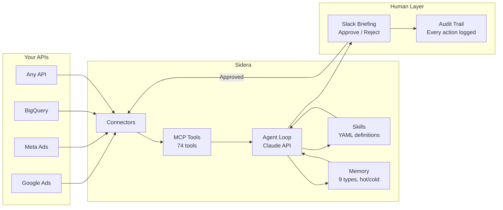

<p align="center">
  <h1 align="center">Sidera</h1>
  <p align="center"><strong>Open-source framework for building AI employees</strong></p>
  <p align="center">
    Connect APIs &middot; Teach skills via YAML &middot; Approve actions in Slack &middot; Automate any role
  </p>
  <p align="center">
    
    
    
    
  </p>
  <p align="center">
    <a href="#try-it-in-5-minutes">Demo</a> &middot;
    <a href="#quickstart">Quickstart</a> &middot;
    <a href="QUICKSTART.md">Full Setup Guide</a> &middot;
    <a href="CONTRIBUTING.md">Contributing</a> &middot;
    <a href="docs/onboarding/01-Executive-Overview.md">Docs</a>
  </p>
</p>

---

Sidera is a framework for building **autonomous AI agents** that connect to your company's tools, analyze data on a schedule, recommend actions via Slack, and execute with human approval.

The core pattern is domain-agnostic: connect any data source, teach skills via YAML, get structured Slack briefings with approve/reject buttons, and log every action. Swap the connectors and skills, and Sidera becomes a different employee.

**You own everything.** The code, the data, the skills, the deployment.

## Try It in 5 Minutes

```bash
git clone https://github.com/mzola/sidera.git && cd sidera
python -m venv .venv && source .venv/bin/activate
pip install -e ".[dev]"

export ANTHROPIC_API_KEY="your-key-here"
make demo
```

This runs a full agent briefing cycle against sample data — no database, no external services, no Slack. Just Python and an Anthropic API key.

## How It Works



**Every morning, your AI employees:**
1. Pull data from connected APIs (Phase 1: Haiku, ~$0.02)
2. Analyze performance against your goals (Phase 2: Sonnet, ~$0.15)
3. Add strategic recommendations (Phase 3: Opus, ~$0.35 — auto-skips on stable days)
4. Post a briefing to Slack with approve/reject buttons
5. Execute approved actions and log everything

**Throughout the day:**
- `@Sidera talk to the media buyer` — chat with any role in a Slack thread
- `/sidera run anomaly_detector` — trigger any skill on demand
- Approve actions from your phone — Slack buttons work everywhere

## Core Features

### Skill System — YAML-Defined Intelligence

Skills are how you teach agents. No code required:

```yaml
# src/skills/library/marketing/performance_media_buyer/anomaly_detector.yaml
name: Anomaly Detector
category: analysis
model: sonnet
schedule: "0 7 * * 1-5"  # 7 AM weekdays

system_supplement: |
  MANDATORY ANALYSIS SEQUENCE:
  1. Pull 30 days of data from Google Ads AND Meta
  2. Compute baselines for all KPIs (CPA, ROAS, CTR, CPC, CPM, CVR, spend, conversions)
  3. Flag anything beyond 2 standard deviations
  4. Cross-reference against backend BigQuery data
  5. Rank anomalies by financial impact

business_guidance: |
  HARD RULES:
  - Backend data ALWAYS overrides platform-reported metrics
  - Never recommend pausing a campaign based on a single day
  - Always check day-of-week patterns before flagging
```

Three-level hierarchy with context inheritance:

```
Department (Marketing)
  └── vocabulary, shared context
       └── Role (Performance Media Buyer)
            └── persona, principles, goals, memory
                 └── Skill (Anomaly Detector)
                      └── specific instructions, schedule, model
```

Context flows down. A skill inherits everything above it.

### Human-in-the-Loop — Three Trust Tiers

| Tier | How It Works | Example |
|------|-------------|---------|
| **Tier 1: Read-Only** | Agent reads data, reports findings. No write actions. | Daily briefings, anomaly reports |
| **Tier 2: Auto-Execute** | Pre-approved rules for low-risk, repetitive actions. Caps, cooldowns, kill switch. | Pause campaigns with CPA > 3x target |
| **Tier 3: Manual Approval** | Every action gets an Approve/Reject button in Slack. | Budget changes, bid strategy updates |

Auto-execute is **off by default**. When enabled, every rule has daily caps, cooldown periods, and a global kill switch. All actions are logged to an immutable audit trail.

### Manager Roles — AI That Delegates

Manager roles run their own analysis, then decide which sub-roles to activate:

```
Head of Marketing (Manager)
  ├── runs executive_summary skill
  ├── LLM decides: "activate media buyer + analyst today"
  ├── Media Buyer runs anomaly_detector, creative_analysis
  ├── Reporting Analyst runs weekly_report
  └── Manager synthesizes everything into one unified briefing
```

Recursive managers supported (CEO manages department heads who manage individual contributors).

### Persistent Memory — Agents That Learn

Nine memory types, tiered hot/cold architecture:

| Type | What It Stores | Example |
|------|---------------|---------|
| **Decision** | Past approval outcomes | "Budget increase for Campaign X improved ROAS by 15%" |
| **Anomaly** | Detected spikes/drops | "Meta CPM spike on Black Friday — seasonal, not a problem" |
| **Lesson** | Mistakes and learnings | "Don't recommend pausing branded campaigns during sales events" |
| **Commitment** | Promises made in conversation | "I said I'd investigate the CTR drop tomorrow" |
| **Steward Note** | Human-injected guidance | "Always prioritize Campaign X — it's the CEO's pet project" |
| **Cross-Role Insight** | Learnings from peer roles | "Reporting analyst found weekend traffic converts at half the rate" |

Hot memories (last 90 days) are auto-injected into every agent run. Cold memories are searchable. Agents learn from every execution. Weekly consolidation detects contradictions and boosts confidence.

### Conversational Mode — Talk to Any Role

Every role is both autonomous (scheduled) and conversational (Slack threads):

```
You:     @Sidera talk to the media buyer
Sidera:  Hey! I'm the Performance Media Buyer. I've been monitoring your
         campaigns — what would you like to dig into?

You:     What's going on with the Meta CPM spike this week?
Sidera:  [pulls data, analyzes, responds in character with findings]

You:     Can you pause the underperforming ad sets?
Sidera:  I'd recommend pausing these 3 ad sets:
         [Approve] [Reject]  ← buttons appear in-thread
```

Write operations work in conversations — the agent proposes actions, you approve or reject inline.

### Skill Evolution — Agents Improve Themselves

Agents propose changes to their own skill definitions through a safety-gated approval pipeline:
- Post-run reflection generates lessons and detects capability gaps
- Recurring friction (3+ lessons about the same skill) triggers skill modification proposals
- All proposals routed through human approval — agents **cannot** bypass their own safety controls
- Agents can also propose new roles when they detect out-of-scope requests

## Build Your Own

Sidera ships with 8 connectors and 11 skills for marketing. But the framework is domain-agnostic — swap connectors and skills for any domain:

| Domain | Connectors You'd Add | Example Skills |
|--------|---------------------|---------------|
| **Customer Support** | Zendesk, Stripe, product DB | Ticket triage, churn risk, refund recommendations |
| **Engineering** | GitHub, Jira, PagerDuty, Datadog | Sprint health, incident postmortem, tech debt prioritization |
| **E-Commerce** | Shopify, inventory, shipping API | Reorder alerts, return analysis, demand forecasting |
| **Finance** | QuickBooks, Stripe, bank API | Cash flow monitor, invoice follow-up, anomaly detection |
| **HR / Recruiting** | Greenhouse, Lever, HRIS | Pipeline health, interview scheduling, offer analysis |

**Adding a connector:** Copy `src/templates/connector_template.py`, implement your methods, register MCP tools. The agent loop, approval flow, and audit trail stay identical.

**Adding a skill:** Write a YAML file and drop it in the right folder. See [Skill Creation Guide](docs/skill-creation-guide.md).

**Adding a department/role:** Create `_department.yaml` and `_role.yaml` config files. See [CONTRIBUTING.md](CONTRIBUTING.md).

## Built-In Connectors

Ships with 8 connectors as reference implementations:

| Connector | Read | Write | Purpose |
|-----------|------|-------|---------|
| **Google Ads** | 7 | 6 | Campaigns, keywords, budgets, bids |
| **Meta Ads** | 7 | 6 | Campaigns, ad sets, ads, targeting |
| **BigQuery** | 7 | — | Backend source of truth (revenue, attribution) |
| **Google Drive** | 13 | — | Docs, Sheets, Slides |
| **Slack** | 19 | — | Briefings, approvals, conversations |
| **Recall.ai** | 5 | — | Meeting transcripts (Google Meet, Zoom) |
| **SSH** | 7 | — | Remote server execution with safety filter |
| **Computer Use** | 3 | — | Desktop automation via Anthropic Computer Use |

## Architecture

```
src/
  agent/        Core AI agent loop, prompts, three-phase model routing
  skills/       YAML skill definitions, registry, router, executor, evolution
  connectors/   API clients (8 connectors + retry utility)
  mcp_servers/  74 MCP tools the agent can use
  workflows/    18 workflows: Inngest durable functions (cron, approval, execution)
  db/           Async SQLAlchemy + 115-method CRUD service
  api/          FastAPI app, OAuth routes, webhooks, Slack commands
  cache/        Redis caching with @cached decorator
  middleware/   Sentry, rate limiting, auth, RBAC
  llm/          Hybrid model routing (Claude + external providers)
  mcp_stdio/    MCP server for Claude Code integration
  meetings/     Listen-only meeting participation
  templates/    Templates for adding new connectors and tools
dashboard/      Streamlit admin UI (6 pages)
tests/          4221+ unit and integration tests
alembic/        29 database migrations
```

**Stack:** Python 3.13 &middot; FastAPI &middot; Anthropic API &middot; Inngest &middot; PostgreSQL &middot; Redis &middot; Slack Bolt &middot; SQLAlchemy

**Model Routing:** Haiku ($0.02) collects data &rarr; Sonnet ($0.15) analyzes &rarr; Opus ($0.35) adds strategy. Total ~$0.50/day per role. Opus auto-skips on stable days.

### Safety

- **50% budget cap** — no single write operation can change a budget by more than 50%
- **Double-execution prevention** — approved actions can only execute once
- **Circuit breakers** — 20 tool calls per cycle, $10/day LLM cost cap per account
- **Clearance levels** — PUBLIC / INTERNAL / CONFIDENTIAL / RESTRICTED
- **Immutable audit trail** — every action logged with timestamps, costs, steward attribution
- **Stewardship** — every AI role has a designated human accountable for its behavior
- **Forbidden fields** — agents cannot modify their own safety controls via skill evolution

## Quickstart

### Option A: Docker Compose (recommended)

```bash
git clone https://github.com/mzola/sidera.git
cd sidera

cp .env.example .env
# Edit .env — minimum: ANTHROPIC_API_KEY and DATABASE_URL

docker compose up -d
```

This starts: API server (`:8000`), PostgreSQL, Redis, Streamlit dashboard (`:8501`), Inngest dev server (`:8288`).

### Option B: Local Development

```bash
git clone https://github.com/mzola/sidera.git
cd sidera

python -m venv .venv && source .venv/bin/activate
pip install -e ".[dev,dashboard]"

cp .env.example .env
# Edit .env with your API keys

alembic upgrade head      # Run database migrations

# Start (3 terminals)
make dev                  # API server
make dashboard            # Streamlit UI
npx inngest-cli@latest dev  # Workflow engine
```

See **[QUICKSTART.md](QUICKSTART.md)** for the complete setup guide including Slack app creation, OAuth configuration, and your first briefing.

## Configuration

All configuration via environment variables. See [`.env.example`](.env.example) for the full list with inline documentation.

| Variable | Required | Description |
|----------|----------|-------------|
| `ANTHROPIC_API_KEY` | Yes | Claude API key |
| `DATABASE_URL` | Yes | PostgreSQL connection string |
| `SLACK_BOT_TOKEN` | For Slack | Slack app bot token |
| `GOOGLE_ADS_DEVELOPER_TOKEN` | For Google Ads | API access token |
| `META_APP_ID` | For Meta | Marketing API access |
| `BIGQUERY_PROJECT_ID` | For BigQuery | Backend data source |
| `REDIS_URL` | Recommended | Caching (gracefully degrades without) |

## Development

```bash
make demo          # Run zero-config demo
make lint          # Lint with ruff
make test          # Run 4200+ tests
make sync-docs     # Verify doc counts match codebase
make cleanup       # All of the above
```

Pre-commit hooks: `make pre-commit`

## By the Numbers

| Metric | Count |
|--------|-------|
| Tests | 4221+ |
| MCP tools | 74 |
| DB service methods | 115 |
| Inngest workflows | 18 |
| Database migrations | 29 |
| Connectors | 8 |
| YAML skills | 11 (examples — add your own) |
| Departments | 3 |
| Agent roles | 7 |

## Contributing

Contributions welcome! See **[CONTRIBUTING.md](CONTRIBUTING.md)** for details.

The fastest ways to contribute:

1. **Add skills** — Write YAML skill definitions for new domains ([guide](docs/skill-creation-guide.md))
2. **Add connectors** — Copy `src/templates/connector_template.py`, implement read/write methods
3. **Improve existing skills** — The 11 example skills are starting points, not finished products
4. **Add departments** — Create `_department.yaml` and `_role.yaml` for new verticals
5. **Report bugs** — Open an issue with reproduction steps

## License

MIT — do whatever you want with it.
